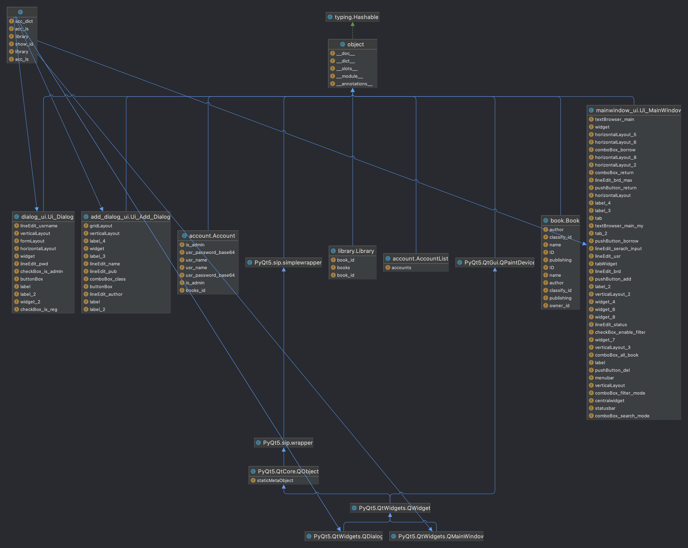
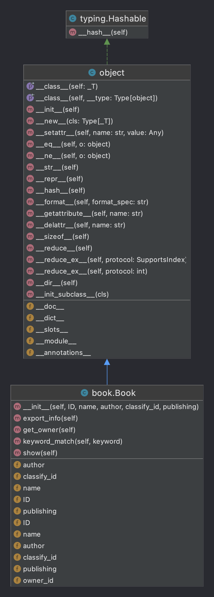
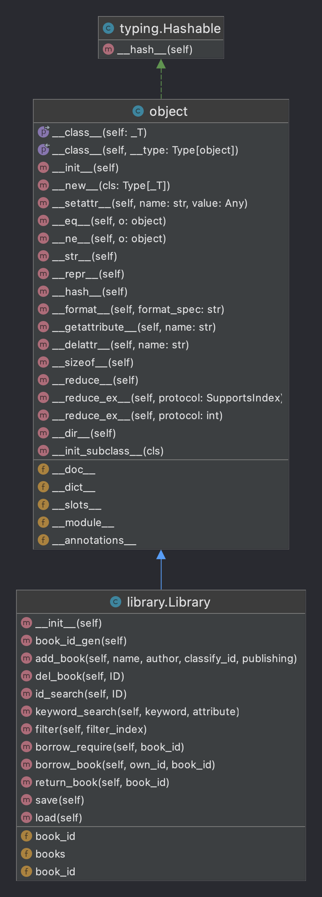
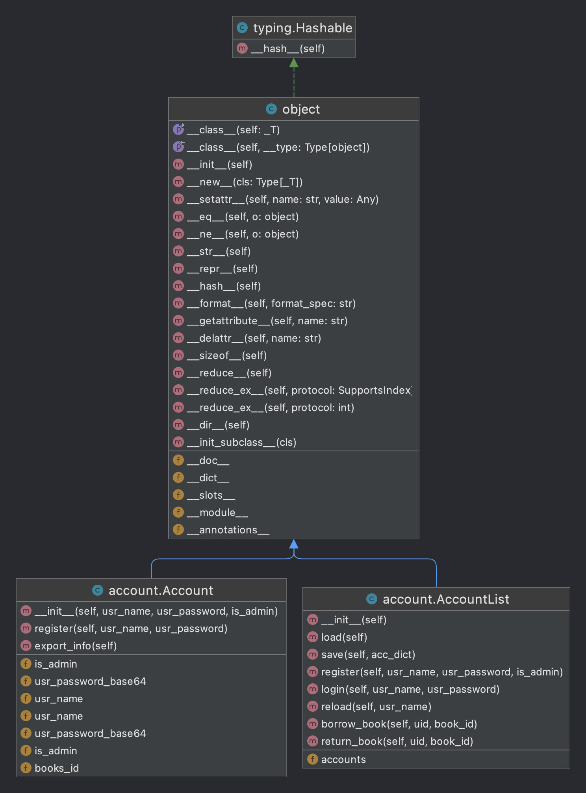
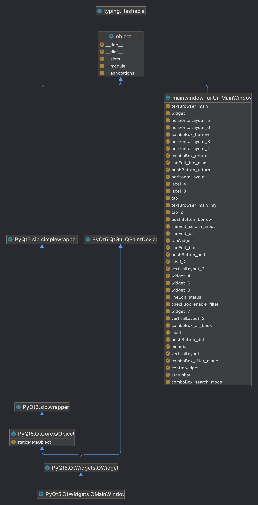

# 图书管理系统

[](https://wakatime.com/badge/github/WitchElaina/library-system)   

USTB Python程序设计大作业

## 功能介绍

### 书籍管理

#### 基础信息

每个图书包含ID, 书名, 作者, 分类, 出版社等基础信息, 在录入时显示

#### 添加删除

管理员账户可以添加或删除书籍

#### 数据导入导出

可以导入其他数据, 或导出

### 书籍查询

用户可以根据ID精确查询书籍, 也可以通过关键词搜索书籍

### 借阅登记

普通用户可以借阅最多三本书籍


## 系统设计

### 书籍类

包含书籍的基本信息

### 图书馆类

拥有列表存放书籍

### 客户端类

包含图形界面已经对应文件io操作

---

> 以下为报告内容

## 项目背景和意义

传统图书馆借阅书籍需要依靠人工手动录入, 过程繁琐且费时费力, 因此可以采用计算机辅助管理图书馆中图书, 减轻图书管理员工作负担, 给用户借阅/归还图书提供便利

## 需求分析

程序应能记录书籍基本信息, 同时可以根据关键字查询对应书籍, 根据分类筛选对应书籍, 提供管理员账户和普通账户两种不同权限的账户, 管理员可以对数据库中的书籍进行增删操作, 管理员和普通账户都能借阅和归还书籍, 程序应将内存中数据实时保存至本地存储, 方便下次启动时调用数据

## 概要和详细设计

### 代码总框架



各个文件介绍如下

```
.
├── README.md			# 说明文档
├── cli.py				# 主程序
├── account.json		# 存放账户数据的json文件
├── account.py			# 账户类
├── add_dialog.ui		# 添加书籍对话框的ui文件
├── add_dialog_ui.py	# 添加书籍对话框的实现
├── book.py				# 书籍类
├── dialog.ui			# 注册登录对话框的ui文件
├── dialog_ui.py		# 注册登录对话框的ui实现
├── library.json		# 存放图书数据的json文件
├── library.py			# 图书馆类
├── mainwindow.ui		# 主窗口ui文件
├── mainwindow_ui.py	# 主窗口ui实现
└── requirements.txt	# 依赖
```

### 各部分框图

#### 图书类



#### 图书馆类



#### 账户类



#### 客户端类



### 类和函数的接口设计

#### 图书类Book

| Name        | Type | Annotation      |
| ----------- | ---- | --------------- |
| ID          | int  | 图书ID          |
| name        | str  | 图书名称        |
| author      | str  | 图书作者        |
| classify_id | int  | 图书分类id      |
| publishing  | str  | 图书出版社      |
| owner_id    | str  | 图书当前租户UID |

| Name          | Args                                            | Return | Annotation                                                   |
| ------------- | ----------------------------------------------- | ------ | ------------------------------------------------------------ |
| \_\_init\_\_  | self, ID, name, author, classify_id, publishing | None   | 图书类初始化函数                                             |
| export_info   | self                                            | Dict   | 获取存储当前图书信息的字典                                   |
| get_owner     | self                                            | str    | 获取当前图书的租户, 如无则返回'None'                         |
| keyword_match | self, keyword                                   | List   | 将当前图书的各个属性依次与关键词进行匹配, 返回匹配结果的真值表 |
| show          | self                                            | str    | 返回格式化的图书信息字符串                                   |

#### 图书馆类Library

| Name    | Type | Annotation                                         |
| ------- | ---- | -------------------------------------------------- |
| books   | List | 所有存书的列表, 成员属性为Book                     |
| book_id | int  | 书籍ID生成器, 每次新建书籍时作为当前书籍的ID并自增 |

| Name           | Args                                        | Return   | Annotation                                         |
| -------------- | ------------------------------------------- | -------- | -------------------------------------------------- |
| book_id_gen    | self                                        | int      | 书籍ID生成器, 返回当前书籍的ID并使book_id自增      |
| add_book       | self, name, author, classify_id, publishing | None     | 向图书馆中新建图书                                 |
| del_book       | self, ID                                    | bool     | 删除对应ID的图书, 成功返回True, 否则返回False      |
| id_search      | self, ID                                    | str/List | 查找对应ID的书籍, 成功返回其ID, 否则返回空列表     |
| keyword_search | self, keyword, attribute                    | List     | 查找对应关键词的书籍, 返回符合搜索结果的书籍ID列表 |
| filter         | self, filter_index                          | List     | 根据图书分类筛选图书, 返回符合筛选结果的书籍ID列表 |
| borrow_require | self, book_id                               | bool     | 查询对应ID的图书是否被借阅                         |
| borrow_book    | self, own_id, book_id                       | bool     | 向ID为own_id的用户借阅ID为book_id的图书            |
| return_book    | self, book_id                               | bool     | 归还对应ID的图书                                   |
| save           | self                                        | None     | 保存内存中数据至 `library.json`                    |
| load           | self                                        | None     | 从 `library.json`中加载数据至内存                  |

####  账户类Account

静态方法

| Name             | Args         | Return | Annotation             |
| ---------------- | ------------ | ------ | ---------------------- |
| usr_name_checker | usr_name     | None   | 检测用户名是否合法     |
| password_checker | usr_password | None   | 检测密码是否合法及安全 |

账户类成员及方法

| Name                | Type | Annotation           |
| ------------------- | ---- | -------------------- |
| usr_name            | str  | 用户名(ID)           |
| usr_password_base64 | str  | base64加密的用户密码 |
| is_admin            | bool | 是否管理员账户       |
| books_id            | list | 当前借阅书籍ID列表   |

| Name         | Args                                   | Return | Annotation             |
| ------------ | -------------------------------------- | ------ | ---------------------- |
| \_\_init\_\_ | self, usr_name, usr_password, is_admin | None   | 用户构造函数           |
| register     | self, usr_name, usr_password           | None   | 用户注册               |
| export_info  | self                                   | Dict   | 返回存放用户信息的字典 |

#### 账户列表类AccountList

| Name     | Type | Annotation         |
| -------- | ---- | ------------------ |
| accounts | list | 存放所有账户的列表 |

| Name        | Args                                   | Return | Annotation                              |
| ----------- | -------------------------------------- | ------ | --------------------------------------- |
| save        | self                                   | None   | 保存内存中所有账户数据至 `account.json` |
| load        | self                                   | None   | 从 `account.json`中加载账户数据至内存   |
| register    | self, usr_name, usr_password, is_admin | bool   | 注册新账户                              |
| login       | self, usr_name, usr_password           | bool   | 登录新账户                              |
| reload      | self, usr_name                         | Dict   | 重载账户信息                            |
| borrow_book | self, uid, book_id                     | None   | 将对应图书借给对应账户                  |
| return_book | self, uid, book_id                     | None   | 对应账户归还对应图书                    |