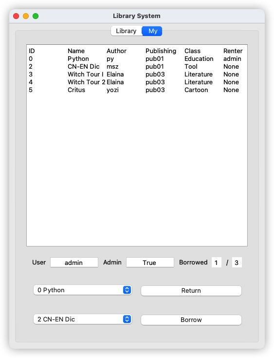

# 图书管理系统

[](https://wakatime.com/badge/github/WitchElaina/library-system)   

USTB Python程序设计大作业

## 功能介绍

### 书籍管理

#### 基础信息

每个图书包含ID, 书名, 作者, 分类, 出版社等基础信息, 在录入时显示

#### 添加删除

管理员账户可以添加或删除书籍

#### 数据导入导出

可以导入其他数据, 或导出

### 书籍查询

用户可以根据ID精确查询书籍, 也可以通过关键词搜索书籍

### 借阅登记

普通用户可以借阅最多三本书籍


## 系统设计

### 书籍类

包含书籍的基本信息

### 图书馆类

拥有列表存放书籍

### 客户端类

包含图形界面已经对应文件io操作

---

> 以下为报告内容

## 项目背景和意义

传统图书馆借阅书籍需要依靠人工手动录入, 过程繁琐且费时费力, 因此可以采用计算机辅助管理图书馆中图书, 减轻图书管理员工作负担, 给用户借阅/归还图书提供便利

## 需求分析

程序应能记录书籍基本信息, 同时可以根据关键字查询对应书籍, 根据分类筛选对应书籍, 提供管理员账户和普通账户两种不同权限的账户, 管理员可以对数据库中的书籍进行增删操作, 管理员和普通账户都能借阅和归还书籍, 程序应将内存中数据实时保存至本地存储, 方便下次启动时调用数据

## 概要和详细设计

### 代码总框架


各个文件介绍如下

```
.
├── README.md			# 说明文档
├── cli.py				# 主程序
├── account.json		# 存放账户数据的json文件
├── account.py			# 账户类
├── add_dialog.ui		# 添加书籍对话框的ui文件
├── add_dialog_ui.py	# 添加书籍对话框的实现
├── book.py				# 书籍类
├── dialog.ui			# 注册登录对话框的ui文件
├── dialog_ui.py		# 注册登录对话框的ui实现
├── library.json		# 存放图书数据的json文件
├── library.py			# 图书馆类
├── mainwindow.ui		# 主窗口ui文件
├── mainwindow_ui.py	# 主窗口ui实现
└── requirements.txt	# 依赖
```

### 各部分框图

#### 图书类


#### 图书馆类


#### 账户类


#### 客户端类


### 类和函数的接口设计

#### 图书类Book

| Name        | Type | Annotation      |
| ----------- | ---- | --------------- |
| ID          | int  | 图书ID          |
| name        | str  | 图书名称        |
| author      | str  | 图书作者        |
| classify_id | int  | 图书分类id      |
| publishing  | str  | 图书出版社      |
| owner_id    | str  | 图书当前租户UID |

| Name          | Args                                            | Return | Annotation                                                   |
| ------------- | ----------------------------------------------- | ------ | ------------------------------------------------------------ |
| \_\_init\_\_  | self, ID, name, author, classify_id, publishing | None   | 图书类初始化函数                                             |
| export_info   | self                                            | Dict   | 获取存储当前图书信息的字典                                   |
| get_owner     | self                                            | str    | 获取当前图书的租户, 如无则返回'None'                         |
| keyword_match | self, keyword                                   | List   | 将当前图书的各个属性依次与关键词进行匹配, 返回匹配结果的真值表 |
| show          | self                                            | str    | 返回格式化的图书信息字符串                                   |

#### 图书馆类Library

| Name    | Type | Annotation                                         |
| ------- | ---- | -------------------------------------------------- |
| books   | List | 所有存书的列表, 成员属性为Book                     |
| book_id | int  | 书籍ID生成器, 每次新建书籍时作为当前书籍的ID并自增 |

| Name           | Args                                        | Return   | Annotation                                         |
| -------------- | ------------------------------------------- | -------- | -------------------------------------------------- |
| book_id_gen    | self                                        | int      | 书籍ID生成器, 返回当前书籍的ID并使book_id自增      |
| add_book       | self, name, author, classify_id, publishing | None     | 向图书馆中新建图书                                 |
| del_book       | self, ID                                    | bool     | 删除对应ID的图书, 成功返回True, 否则返回False      |
| id_search      | self, ID                                    | str/List | 查找对应ID的书籍, 成功返回其ID, 否则返回空列表     |
| keyword_search | self, keyword, attribute                    | List     | 查找对应关键词的书籍, 返回符合搜索结果的书籍ID列表 |
| filter         | self, filter_index                          | List     | 根据图书分类筛选图书, 返回符合筛选结果的书籍ID列表 |
| borrow_require | self, book_id                               | bool     | 查询对应ID的图书是否被借阅                         |
| borrow_book    | self, own_id, book_id                       | bool     | 向ID为own_id的用户借阅ID为book_id的图书            |
| return_book    | self, book_id                               | bool     | 归还对应ID的图书                                   |
| save           | self                                        | None     | 保存内存中数据至 `library.json`                    |
| load           | self                                        | None     | 从 `library.json`中加载数据至内存                  |

####  账户类Account

静态方法

| Name             | Args         | Return | Annotation             |
| ---------------- | ------------ | ------ | ---------------------- |
| usr_name_checker | usr_name     | None   | 检测用户名是否合法     |
| password_checker | usr_password | None   | 检测密码是否合法及安全 |

账户类成员及方法

| Name                | Type | Annotation           |
| ------------------- | ---- | -------------------- |
| usr_name            | str  | 用户名(ID)           |
| usr_password_base64 | str  | base64加密的用户密码 |
| is_admin            | bool | 是否管理员账户       |
| books_id            | list | 当前借阅书籍ID列表   |

| Name         | Args                                   | Return | Annotation             |
| ------------ | -------------------------------------- | ------ | ---------------------- |
| \_\_init\_\_ | self, usr_name, usr_password, is_admin | None   | 用户构造函数           |
| register     | self, usr_name, usr_password           | None   | 用户注册               |
| export_info  | self                                   | Dict   | 返回存放用户信息的字典 |

#### 账户列表类AccountList

| Name     | Type | Annotation         |
| -------- | ---- | ------------------ |
| accounts | list | 存放所有账户的列表 |

| Name        | Args                                   | Return | Annotation                              |
| ----------- | -------------------------------------- | ------ | --------------------------------------- |
| save        | self                                   | None   | 保存内存中所有账户数据至 `account.json` |
| load        | self                                   | None   | 从 `account.json`中加载账户数据至内存   |
| register    | self, usr_name, usr_password, is_admin | bool   | 注册新账户                              |
| login       | self, usr_name, usr_password           | bool   | 登录新账户                              |
| reload      | self, usr_name                         | Dict   | 重载账户信息                            |
| borrow_book | self, uid, book_id                     | None   | 将对应图书借给对应账户                  |
| return_book | self, uid, book_id                     | None   | 对应账户归还对应图书                    |

### 用户界面设计

使用`PyQt5`编写图形界面, UI设计图如下

主界面


我的


登录/注册界面


添加图书界面


### 技术手段选型

开发语言选择Python3.10

图形界面框架选择PyQt5, 可以快捷方便地实现简单的图形界面, 且跨平台支持性较好

文件存储方式选择json, python中自带的库json可以很方便地将json格式字符串转换为python中字典, 同时json键值对格式的数据存储方式也便于读写, 相较txt开发难度低, 相较数据库方便快捷, 因此十分合适

### 开发手段及工具

使用版本管理工具`Git`进行代码的版本管理, 同时配合代码托管平台`GitHub`及时上传代码, 相应证明如下:

GitHub仓库链接: https://github.com/WitchElaina/library-system

Git历史提交查看(截止编写报告前):


## 代码实现

### 依赖及环境

在开发设备上输入`python3`得到以下关于python版本的输出

```
Python 3.10.2 (main, Feb  2 2022, 08:42:42) [Clang 13.0.0 (clang-1300.0.29.3)] on darwin
```

使用`pip freeze > requirement.txt`获取依赖及其版本, 内容如下

```
PyQt5==5.15.6
```

### 关键代码说明

#### JSON读写

以读取书单为例

```python
    def load(self):
        """load data from library.json"""
        with open(file_dir + 'library.json', 'r') as data_f:
            data_dict = json.loads(data_f.read())
        self.book_id = data_dict['id_gen']
        data = data_dict['data']
        for key_id in data:
            new_book = book.Book(key_id, data[key_id]['name'], data[key_id]['author'], data[key_id]['classify_id'], data[key_id]['publishing'])
            new_book.owner_id = data[key_id]['owner_id']
            self.books.append(new_book)
```

首先以文本方式打开对应json文件, 读取json字符串, 随后使用`loads`函数将字符串转化为python字典, 随后就可以通过键访问对应值

写入时同理, 先将所有数据存储为字典, 随后使用`dumps`函数将python字典转化为json字符串, 随后以文本方式写入json文件中, 代码如下:

```python
    def save(self):
        """save current data to json file"""
        # gen data dictionary
        data_dict = {'id_gen': self.book_id, 'data':{}}
        for i in self.books:
            data_dict['data'][i.ID] = i.export_info()

        # write to json
        data_json = json.dumps(data_dict)
        with open(file_dir + 'library.json', 'w+') as data_f:
            data_f.write(data_json)
```

#### 注册

首先从内存中加载所有注册用户数据, 注册时会检索当前用户名是否存在, 如果存在则不允许注册, 若不存在, 则会验证用户名与密码是否符合要求, 用户名不能是空字符串/数字开头的字符串或包含特殊字符的字符串, 用户密码同理且至少得包含数字/特殊字符/大写字母/小写字母中的三种, 如检索通过则将密码base64加密后存储

此部分代码难点是检索字符串格式是否合法, 最高效的写法是使用正则表达式, 对应代码如下

```python
def password_checker(usr_password):
    HAS_AT_LEAST_THREE_KINDS_CHARS = re.compile("(?![a-z0-9]+$)")

    if len(usr_password) > 40:
        raise Exception("Invalid password(length)!", usr_password, len(usr_password))
    if usr_password.isspace():
        raise Exception("Invalid password(is space)!")
    if not HAS_AT_LEAST_THREE_KINDS_CHARS.search(usr_password):
        raise Exception("Invalid password(too simple)!")


def usr_name_checker(usr_name):
    ONLY_NUM_AND_LETTER = re.compile("^(?!\d+$)[\da-zA-Z_]+$")
    FIRST_CHAR_IS_LETTER = re.compile("^[a-zA-Z]")
    if len(usr_name) > 20:
        raise Exception("Invalid username(length)!", usr_name, len(usr_name))
    if usr_name.isspace():
        raise Exception("Invalid username(is space)!")
    if not ONLY_NUM_AND_LETTER.search(usr_name):
        raise Exception("Invalid username(special char)!", usr_name)
    if not FIRST_CHAR_IS_LETTER.search(usr_name):
        raise Exception("Invalid username(invalid first char)!", usr_name[0])
```

#### 登录

登录时需注意, 出于安全性考虑程序存储的密码为base64加密的代码, 因此需要将用户输入的密码进行同样的加密后与再存储的密码比对, 实现如下

```python
    def login(self, usr_name, usr_password):
        acc_dict = self.load()
        if usr_name not in acc_dict:
            return False
        else:
            if str(base64.b64encode(usr_password.encode('utf-8'))) == acc_dict[usr_name]['password']:
                return acc_dict[usr_name]
            else:
                return False
```

#### 书籍检索

当用户在搜索栏输入时, 程序监听到这一事件后会自动触发搜索函数, 将得到的结果显示在主窗口中, 搜索的过程实际上是字符串查找子串的过程, 遍历所有数据, 找到含有搜索关键字的字符串, 返回对应结果即可

核心代码如下

```python
    def keyword_match(self, keyword):
        """match keyword in book info"""
        # return if match success in each item
        # example:
        #   [0,0,1,0]: name False, author True, publishing False
        ret_truth_table = [False, False, False, False]
        
        if self.name.find(keyword) != -1:
            ret_truth_table[1] = True
        if self.author.find(keyword) != -1:
            ret_truth_table[2] = True
        if self.publishing.find(keyword) != -1:
            ret_truth_table[3] = True

        return ret_truth_table
""""""
	def keyword_search(self, keyword, attribute):
        """search book by keyword"""
        ret = []  # result id list
        for i in self.books:
            if i.keyword_match(keyword)[attribute]:
                ret.append(i.ID)
        return ret
```

上述代码中keyword_match是书籍类的方法, 会将书籍类中的各个属性依次匹配关键字并将匹配结果按一定顺序返回, 这样做的好处是无论用户按名称还是作者还是其他的方式检索书籍, 都只用调用同一个函数, 大大简化了代码重复度

keyword_search是图书馆类的方法, 当用户进行搜索时会调用所有图书的keyword_match方法, 如果对应找到符合的书籍则将其ID插入搜索结果中, 最后返回; 参数attribute是一个整数, 用于指代ret_truth_table的下标

## 程序展示和测试

### 注册账户

为方便演示, 注册一个拥有所有权限的管理员账户, 用户名为`admin`, 密码为`Tt1234`


注册成功即可进入登录界面, 现在点击`Add`添加书籍


最终结果如下


为方便演示, 多添加几种不同书籍


### 筛选

筛选所有文学作品, 直接打开`Filter`选项并选择`Literature`即可


### 查找

在搜索框输入关键字, 并在右边选择查找选项即可, 两个演示如下


### 删除书籍

选中`1 C++`并点击`Delete Book`, 即可看到书籍被删除


### 借阅书籍


可以看到书籍对应的`Renter`已经自动更新, 且个人借阅数也已正常刷新, 当个人借阅达到三本后将无法借阅更多书籍

### 归还书籍

现在点击`Return`归还`Witch Tour I`



可以看到对应信息已经刷新

### 关于页面

点击`Library>About`即可看到


## 结论和未来方向

本程序基本实现了图书管理的相应功能, 但仍有许多待改进的地方, 如

普通账户和管理员账户采用统一客户端, 普通账户权限不足因此无法与许多UI控件交互, 体验较差, 以后可以考虑面向管理员和普通用户使用两套客户端

管理员账户增删书籍时无法批量操作, 在面对大量数据时操作较为繁琐, 仍需优化

由于在macOS上开发, UI在Windows下表现不够美观, 体验较差, 后续可以针对不同平台改进UI设计

## 致谢

程序设计过程中PyQt官方文档帮助了我许多: https://doc.qt.io/qtforpython/

程序logo设计使用了Apple提供的模板: https://developer.apple.com/design/human-interface-guidelines/macos/icons-and-images/app-icon/

## 参考文献

https://doc.qt.io/qtforpython/

https://developer.apple.com/design/human-interface-guidelines/macos/icons-and-images/app-icon/

https://docs.python.org/3/library/json.html

